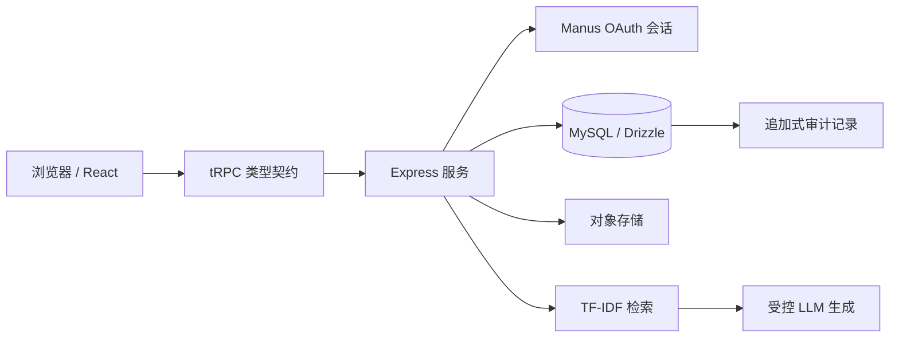

# CampusMate 需求与架构说明

## 项目目标

CampusMate 是一个用于展示 AI 应用工程能力的校园二手商城演示项目。它将商品发现、模拟订单、服务端权限、基于证据的客服 Agent 与固定评测放在同一条可演示链路中。所有商品和订单数据均明确标注为演示数据；系统不处理真实支付或真实售后裁决。

## 核心需求与实现边界

| 业务能力 | 实现策略 | 安全/展示边界 |
|---|---|---|
| 商品发现 | 公开搜索、分类、详情和编辑风商品卡。 | 演示商品不含虚构评价、评分或用户口碑。 |
| 模拟订单 | OAuth 登录后创建、查看本人订单和订单详情。 | 服务端按 `ctx.user.id` 强制过滤；跨账户请求拒绝并审计。 |
| RAG 客服 | 规则文档分块、语料级 TF-IDF、余弦检索、LLM 基于证据生成。 | 低于证据阈值即转人工；回答返回片段、文档与公开来源 URL。 |
| Agent 路由 | 规则问答、商品检索、本人订单、人工转接四类意图。 | 订单工具不接受任意用户身份，只取当前会话。 |
| 管理后台 | 管理员上/下架商品、初始化/上传 Markdown 或文本规则文档、运行评测。 | 前端入口按角色隐藏；服务端 `adminProcedure` 仍是最终门槛。 |
| 评测面板 | 固定案例运行后写入实际记录并计算指标。 | 指标不手填；延迟为本次服务端实际计时，不是生产 SLA。 |

## 架构图

> 权限不依赖前端。浏览器仅决定是否展示入口；订单、后台、知识上传与评测操作均在服务端依据会话用户与角色重新校验。

## 公开规则来源与改写边界

演示知识库基于公开 C2C 平台规则改写，不代表 CampusMate 已获得任何平台授权，也不是校方制度。公开来源指出：争议处理可先协商并使用平台提供的调处方式；既有交易约定对理解争议重要；对侵权、动物、医疗健康和召回风险等商品类别应采取严格限制。[1] [2] [3]

## 面试深挖 Q&A

| 问题 | 可回答要点 |
|---|---|
| 为什么 RAG 先检索再调用模型？ | 检索是证据门槛；模型只整理候选片段。若无片段或分数过低，系统转人工而不是依赖模型常识。 |
| 为什么不用 Embedding API？ | 首版以中文字符/双字符 token、语料级 TF-IDF 与余弦相似度实现零外部依赖、可复现检索；接口与分块表保留，可替换为 Embedding。 |
| 订单怎么防越权？ | 客户端不提交用户 ID；服务端从 OAuth 会话取当前用户，再检查订单所有者。拒绝读会写追加式审计事件。 |
| 为什么后台入口隐藏仍不够？ | URL 和 API 可以被直接构造，因此管理员操作必须经 `adminProcedure` 服务端角色中间件拒绝。 |
| 审计为什么只追加？ | 应用没有更新/删除审计日志的过程，策略函数显式拒绝修改意图。受管 TiDB 不支持触发器，项目将该限制与迁移路径如实记录。 |

## References

[1]: https://terms.alicdn.com/legal-agreement/terms/suit_bu1_other/suit_bu1_other201708081618_51146.html "闲鱼社区用户服务协议"
[2]: https://haibao.m.taobao.com/html/ce42wWSPf "闲鱼社区交易争议处理规范"
[3]: https://www.facebook.com/help/130910837313345 "Things that can't be listed for sale on Facebook Marketplace"
