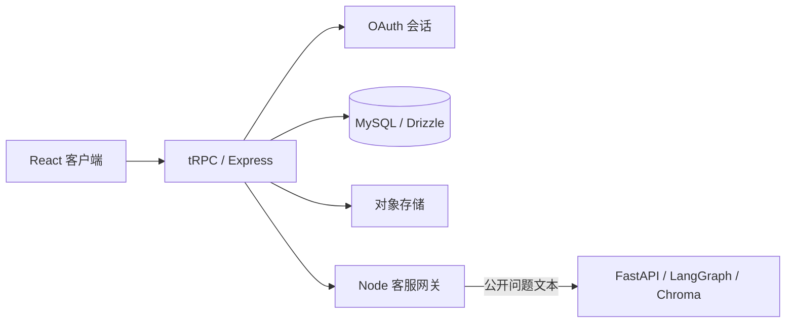

# CampusMate 需求与架构说明

## 1. 产品定位

CampusMate 是面向校园闲置物品流转的模拟交易与规则咨询系统。它将商品发现、模拟订单、用户发布审核、个人账户空间、公开规则客服和管理员运营能力整合在一个 Web 应用中。交付目标是让每项可见功能都有对应的数据归属、服务端权限和失败处理，而不是只提供静态页面。

> 所有商品、订单、图片、工单与规则均为模拟数据。系统不提供真实支付、配送、资金托管或真实人工客服；公开规则只用于一般性交易提示。[1] [2] [3]

## 2. 功能需求与验收标准

| 编号 | 需求 | 用户可见结果 | 服务端验收条件 |
|---|---|---|---|
| FR-01 | 公开商品发现。 | 可浏览、搜索、筛选和查看公开商品详情。 | 公开列表与详情只读取 `active` 商品。 |
| FR-02 | OAuth 登录与角色区分。 | 普通用户和管理员使用不同入口；权限不足显示明确提示。 | 会话上下文提供用户和角色；管理员过程拒绝普通用户。 |
| FR-03 | 模拟订单。 | 登录后可创建、查看自己的订单和订单详情。 | 订单读取按当前 `userId` 过滤；跨账户访问拒绝并审计。 |
| FR-04 | 发布与审核。 | 用户可发布图片、编辑、撤回或重新提交自己的物品；管理员可筛选并批量审核。 | 发布归属从会话取得；状态机禁止非法转换；拒绝原因与批量结果可追溯。 |
| FR-05 | 个人中心。 | 可查看本人订单、发布状态、工单进度，并编辑独立账户资料。 | `profile.mine` 只聚合当前会话范围的数据。 |
| FR-06 | 规则客服。 | 可获得包含公开来源的规则答复；无依据时得到覆盖不足提示。 | Python 只访问公开规则；来源与阈值由程序控制；低置信不生成确定性规则。 |
| FR-07 | 人工支持记录。 | 登录后可在必要时创建和查看自己的模拟工单。 | 工单查询固定按 `userId` 限制；不联系真实客服。 |
| FR-08 | 运营与质量控制。 | 管理员管理商品、规则、角色、工单和服务质量检查。 | `adminProcedure`、追加审计、规则来源验证和逐项审核状态复核。 |
| FR-09 | 系统可观测与审核追溯。 | 管理员可查看 Agent 健康、Embedding、规则索引统计，并在审核队列打开单件详情抽屉。 | 系统状态与详情均经 `adminProcedure`；详情仅返回商品、图片、有限发布者上下文和指定商品的追加式审计记录，不返回密钥或邮箱。 |

## 3. 架构选择

前端使用 React 19、TypeScript 和 Tailwind CSS 构建响应式交互；Express 与 tRPC 负责同源 API、会话和类型契约；MySQL/TiDB 通过 Drizzle ORM 保存业务事实；对象存储保存图片和文档字节。Python FastAPI + LangGraph + Chroma + FastEmbed ONNX 只处理公开规则的语义检索，Node 保留用户身份、订单、工单、LLM 密钥和工具授权。

完整的技术职责、代码摘录、数据模型和运行命令见 [`technical-delivery-guide.md`](./technical-delivery-guide.md)。业务顺序、数据变化和失败响应见 [`end-to-end-business-flow.md`](./end-to-end-business-flow.md)。

## 4. 非功能要求

| 类别 | 当前要求 | 当前边界 |
|---|---|---|
| 权限 | 所有个人和管理员操作在服务端再次验证。 | 不把前端菜单隐藏当成安全控制。 |
| 数据完整性 | 订单保存商品快照；审核状态机只允许定义的转换。 | 数据库环境不使用触发器，审计由应用层追加策略控制。 |
| 文件安全 | 仅允许 JPEG/PNG/WebP，单图最大 2MB，数据库保存对象引用。 | 未接入病毒扫描、OCR 或自动图像内容审核。 |
| RAG 可信性 | 规则回答返回来源，低置信时拒答或提示人工支持。 | Chroma 是容器本地派生索引，MySQL/对象存储才是事实源。 |
| 可维护性 | 数据模型、服务过程、页面、测试和文档同步更新。 | 尚未接入 CI、生产监控和真实流量压测。 |

## 5. 公开规则来源

CampusMate 的规则知识仅提炼公开 C2C 资料中的一般性原则，例如物品限制、争议沟通、描述一致性和交易安全提示。任何涉及校方规定、法律责任、支付或平台官方处罚的问题，系统都应提示用户查询正式渠道。[1] [2] [3]

## References

[1]: https://terms.alicdn.com/legal-agreement/terms/suit_bu1_other/suit_bu1_other201708081618_51146.html "闲鱼社区用户服务协议"
[2]: https://haibao.m.taobao.com/html/ce42wWSPf "闲鱼社区交易争议处理规范"
[3]: https://www.facebook.com/help/130910837313345 "Facebook Marketplace 禁止上架商品"
