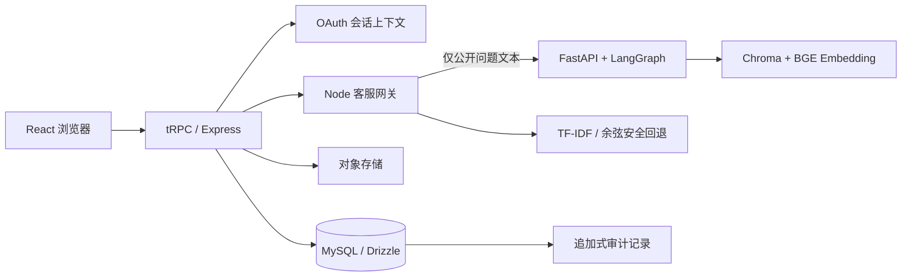

# CampusMate 技术交付说明

## 1. 文档目的与项目边界

CampusMate 是一个校园闲置流转与规则咨询系统。它提供公开商品浏览、登录后的模拟订单、用户发布与审核、个人中心、基于公开规则的智能客服，以及管理员知识库、质量监控和账户管理能力。本说明用于交付、维护和技术沟通：每一项能力都对应具体页面、服务过程、数据表、状态变化和自动化验证。

> **数据披露。** 当前运行环境中的商品、订单、工单和图片均为明确标注的模拟数据。系统不接入真实支付、物流、资金托管或真实人工客服；规则文本仅基于公开 C2C 资料改写，不能替代校方制度、平台正式政策或法律意见。

| 交付目标 | 当前实现 | 明确不包含的能力 |
|---|---|---|
| 校园闲置流转 | 商品发现、搜索、分类、详情、模拟订单、用户发布、审核与个人管理。 | 支付、物流、担保交易、真实售后裁定。 |
| 可信规则咨询 | 公开规则检索、来源返回、低置信拒答、人工支持记录。 | 用模型记忆替代证据、无来源规则承诺。 |
| 账户与权限 | OAuth 登录、本人订单与发布记录隔离、管理员角色控制、审计记录。 | 客户端自选角色、跨账户数据查询。 |
| 后台运维 | 商品审核、规则上传与生命周期、用户角色、工单队列、质量监控。 | 自动化内容审核、异步队列、生产 SLA 承诺。 |

## 2. 技术清单与职责分工

系统采用 Node 与 Python 双运行时。浏览器只负责展示与交互；订单、角色、存储引用和工具授权仍由 Node 服务端控制。Python 运行时只处理公开问题的意图识别与规则检索，因此不会获得 Cookie、订单数据库连接、用户身份或大模型密钥。

| 层次 | 实际技术 | 在 CampusMate 中完成的工作 |
|---|---|---|
| 客户端 | React 19、TypeScript、Vite、Tailwind CSS、shadcn/ui、Wouter。 | 响应式商城、个人中心、发布管理、管理员后台、服务说明与质量监控界面。 |
| 类型化服务层 | Express 4、tRPC 11、Zod、SuperJSON。 | 将登录、商品、订单、客服、个人资料和管理操作定义为端到端类型契约。 |
| 身份与权限 | Manus OAuth、会话 Cookie、`protectedProcedure`、`adminProcedure`。 | 从服务端会话获取当前用户；区分公开、登录和管理员操作。 |
| 数据与 ORM | MySQL/TiDB、Drizzle ORM。 | 保存用户、商品、图片引用、订单快照、规则文档、检索分块、工单、审计与质量检查记录。 |
| 文件存储 | 受控对象存储写入与签名读取。 | 保存用户商品图片和管理员规则原文件；数据库只保存对象键、URL 与元数据。 |
| Node 智能网关 | 内置 LLM API、TF-IDF/余弦回退、Function Calling 解析。 | 编排客服工作流，选择商品检索、本人订单查询或工单创建工具，并在执行前二次授权。 |
| Python RAG 运行时 | Python、FastAPI、LangGraph、Chroma、FastEmbed ONNX、`BAAI/bge-small-zh-v1.5`。 | 对公开规则进行分块、512 维中文语义向量检索、阈值过滤、来源返回和运行时健康检查。 |
| 质量保障 | Vitest、Python 测试脚本、TypeScript 检查、Vite/esbuild 构建。 | 覆盖角色、所有权、状态机、上传校验、RAG、工具边界、规则同步和管理员操作。 |

## 3. 总体架构与数据边界

浏览器所有请求通过同源 `/api/trpc` 到达 Express。Express 从 OAuth 会话构建当前用户上下文；只有公开规则问题会被窄化为 `message` 发送给本机 FastAPI。商品、订单、工单和审核等个人或管理数据不离开 Node/MySQL 边界。



应用路由按业务模块拆分，前端调用不会绕过服务端权限过程。以下代码来自 `server/routers.ts`，展示了实际的服务模块边界：

```ts
export const appRouter = router({
  system: systemRouter,
  auth: router({
    me: publicProcedure.query(opts => opts.ctx.user),
    logout: publicProcedure.mutation(({ ctx }) => {
      ctx.res.clearCookie(COOKIE_NAME, { ...getSessionCookieOptions(ctx.req), maxAge: -1 });
      return { success: true } as const;
    }),
  }),
  catalog: catalogRouter,
  customerService: customerServiceRouter,
  orders: ordersRouter,
  profile: profileRouter,
  admin: adminRouter,
});
```

## 4. 需求到页面、接口和数据表的映射

| 用户需求 | 主要页面 | tRPC/服务端入口 | 核心数据 |
|---|---|---|---|
| 浏览与搜索商品 | `/`、`/goods`、`/goods/:id`。 | `catalog.list`、`catalog.featured`、`catalog.get`。 | `products`、`categories`、`productImages`。 |
| 登录与身份识别 | `/login`。 | OAuth 回调、`auth.me`、`auth.logout`。 | `users`、会话 Cookie。 |
| 创建和查看订单 | `/goods/:id`、`/orders`、`/orders/:id`。 | `orders.create`、`orders.listMine`、`orders.getMine`。 | `orders`、`orderItems`、`products`、`auditLogs`。 |
| 发布与管理闲置物品 | `/publish`、`/profile/listings`。 | `catalog.publish`、`updateListing`、`withdrawListing`、`resubmitListing`。 | `products`、`productImages`、对象存储、`auditLogs`。 |
| 查看个人状态 | `/profile`。 | `profile.mine`、`profile.me`、`profile.updateMe`。 | `users`、订单、本人发布记录、`supportTickets`。 |
| 规则咨询与人工支持 | `/assistant`。 | `customerService.ask`、`createTicket`、`listMyTickets`。 | `knowledgeDocuments`、`knowledgeChunks`、`supportTickets`。 |
| 审核与运营管理 | `/admin`、`/evaluation`。 | `admin.products`、`batchReviewProducts`、知识库、角色、工单和质量监控过程。 | 商品、规则、用户、工单、审计、质量运行记录。 |

## 5. 核心数据模型与状态机

数据模型用数据库主键表达关联，用对象键表达文件引用。商品和订单分离：商品可以被编辑或下架，订单项必须保存下单时的标题与价格快照，避免后续商品变化改写历史订单语义。

| 实体 | 关键字段 | 作用与约束 |
|---|---|---|
| `users` | `openId`、`role`、`profileName`、`campus`、`major`、`bio`。 | OAuth 身份唯一；可编辑资料与身份提供商资料分离。 |
| `products` | `sellerUserId`、`status`、`reviewReason`、`priceCents`。 | 记录商品归属、审核状态和拒绝说明。 |
| `productImages` | `productId`、`storageKey`、`url`、`sortOrder`。 | 保存对象存储引用，不把图片字节存进数据库。 |
| `orders` / `orderItems` | `userId`、`orderCode`、状态、商品标题/价格快照。 | 只允许当前会话用户读取自己的订单。 |
| `knowledgeDocuments` / `knowledgeChunks` | 来源 URL、指纹、向量状态、版本、生命周期、分块内容。 | MySQL/对象存储是事实源，Chroma 是可重建的派生索引。 |
| `supportTickets` | `userId`、分类、原问题、摘要、工作流、状态。 | 只保存当前用户的模拟人工支持记录。 |
| `auditLogs` | 操作人、动作、资源、结果、原因。 | 应用层只追加，用于记录允许和拒绝的关键操作。 |
| `evaluationCases` / `evaluationRuns` | 固定输入、预期结果、实际指标。 | 管理员质量监控的实际运行记录。 |

商品状态为 `pending_review`、`active`、`reserved`、`archived`、`rejected`。其中公开目录和公开详情只读取 `active`；`reserved` 表示已经进入订单流，发布者不能继续修改或撤回。

```ts
export function decideOwnerListingResubmission(status: ListingStatus): Decision {
  if (status === "pending_review") return { kind: "noop", nextStatus: "pending_review" };
  if (status === "rejected" || status === "archived") {
    return { kind: "allow", nextStatus: "pending_review" };
  }
  return { kind: "deny", message: "只有已拒绝或已撤回的商品可以重新提交审核" };
}

export function decideAdministratorReview(status: ListingStatus, action: "approve" | "reject"): Decision {
  if (status !== "pending_review") return { kind: "deny", message: "仅等待审核的商品可参与本次审核" };
  return { kind: "allow", nextStatus: action === "approve" ? "active" : "rejected" };
}
```

## 6. 端到端业务流程

### 6.1 商品浏览与模拟下单

访客可以浏览和搜索公开商品，商品详情页仅返回 `active` 记录。用户决定创建模拟订单时，前端不提交买家 ID；服务端从会话中的 `ctx.user.id` 获得买家，并在同一事务中创建订单、订单项快照、更新商品为 `reserved`，同时写入审计记录。

| 顺序 | 前端动作 | 服务端变化 | 失败与处理 |
|---:|---|---|---|
| 1 | 浏览首页、搜索或筛选。 | 查询公开商品、分类与图片引用。 | 非 `active` 商品不会被公开列表/详情读取。 |
| 2 | 打开商品详情。 | 返回商品信息与图片 URL。 | 商品已下架或被预留时，创建订单过程再次拒绝。 |
| 3 | 点击模拟下单。 | 会话用户写入 `orders`；标题和价格写入 `orderItems` 快照；商品变为 `reserved`。 | 未登录、非公开商品或并发后的非 `active` 状态均被拒绝。 |
| 4 | 查看订单列表/详情。 | 使用当前会话 ID 查询订单。 | 指定他人订单 ID 时，返回拒绝并写审计。 |

订单读取的关键点是**服务端自己取得用户身份**。真实实现的路由调用如下：

```ts
const result = await db.getOrderForActor({
  orderId: input.orderId,
  actorUserId: ctx.user.id,
  isAdmin: false,
});
```

### 6.2 用户发布、编辑、撤回与重新提交

发布页要求分类、标题、价格、成色、详细描述与 1–3 张图片。浏览器先做交互预检；Node 再次验证 data URL 的 MIME、图片大小、字段长度与价格范围，并将图片写入对象存储。数据库只保存对象键和 URL，新商品固定为 `pending_review`，因此不会出现在公开目录中。

| 状态 | 发布者可执行的操作 | 管理员可执行的操作 | 是否公开 |
|---|---|---|---|
| `pending_review` | 编辑；撤回。 | 通过或拒绝。 | 否。 |
| `active` | 编辑；撤回。编辑后重新进入审核。 | 下架或维护状态。 | 是。 |
| `reserved` | 不可编辑、不可撤回。 | 仅按订单流程处理。 | 不作为可下单商品。 |
| `archived` | 编辑；重新提交。 | 可维护状态。 | 否。 |
| `rejected` | 查看拒绝原因；编辑或重新提交。 | 可重新审核。 | 否。 |

管理员批量审核不会用无条件的批量更新覆盖并发变更。服务端为每一个唯一 ID 加锁、重新检查状态、写入单项结果和审计；不存在或状态已变化的商品会被标记为 `skipped`，其余合法商品继续处理。

```ts
batchReviewProducts: adminProcedure
  .input(z.object({
    productIds: z.array(z.number().int().positive()).min(1).max(30),
    action: z.enum(["approve", "reject"]),
    reviewReason: z.string().trim().min(2).max(255).optional(),
  }).superRefine((input, context) => {
    if (input.action === "reject" && !input.reviewReason) {
      context.addIssue({ code: z.ZodIssueCode.custom, message: "批量拒绝必须填写原因" });
    }
  }))
  .mutation(({ ctx, input }) => db.batchReviewProducts({ ...input, actorUserId: ctx.user.id }));
```

### 6.3 规则咨询、工具调用与人工支持

客服首先判断问题属于公开规则、商品搜索、本人订单还是人工支持。规则问题只向 Python 发送文本；订单和工单则在 Node 侧经过 OAuth 检查后执行。原生 Function Calling 只用来提出受限工具意图，不能将模型视为拥有数据库权限的主体。

| 问题类型 | 处理路径 | 数据边界 | 用户结果 |
|---|---|---|---|
| 规则问题 | Node → FastAPI/LangGraph → Chroma/BGE → Node。 | Python 只接收问题文本和公开规则。 | 规则摘要、来源与低置信提示。 |
| 商品搜索 | 路由识别后，Node 查询公开目录。 | 不涉及账户信息。 | 商品候选与链接。 |
| 本人订单 | Node 检查会话，调用所有权查询。 | 用户身份不由模型或浏览器参数决定。 | 本人订单摘要或登录提示。 |
| 人工支持 | 用户明确请求后，登录状态下创建工单。 | 仅当前用户可以看到工单。 | 模拟支持记录与处理状态。 |

以下代码说明订单工具在没有认证会话时直接停止，而不是把身份传给 Python 或尝试查询其他账户：

```ts
if (!input.actor) {
  toolResults.push({ tool: "own_order_lookup", status: "blocked", summary: "未检测到登录会话，订单工具未执行。" });
  return {
    intent,
    answer: "订单查询需要先登录。登录后我只能读取你自己的模拟订单，无法查看其他账户的数据。",
    citations: [],
    handoff: false,
    requiresLogin: true,
    workflow,
    toolResults,
  };
}
```

### 6.4 管理员规则入库与 Chroma 同步

管理员上传 `.md` 或 `.txt` 规则文件时必须提供 HTTPS 公开来源 URL。Node 保存原文件、内容指纹、分块、生命周期和向量状态；Python 接收的只有 `documentId`、标题、来源、内容与指纹。新版本同步成功后才会替代旧版本，失效文档会从 Chroma 派生索引移除。

Python 侧使用 FastEmbed ONNX 加载 `BAAI/bge-small-zh-v1.5`，并检查预训练模型的 512 维输出。模型无法加载时才使用受控哈希向量回退，以保证公开规则服务仍能返回可解释的降级结果。

```python
EMBEDDING_MODEL = os.getenv("CAMPUSMATE_EMBEDDING_MODEL", "BAAI/bge-small-zh-v1.5")
EMBEDDING_DIMENSION = 512
TOP_K = 3
GROUNDING_THRESHOLD = 0.25

def retrieve_policy(state: AgentState) -> AgentState:
    result = COLLECTION.query(
        query_embeddings=[encode_texts([state["message"]])[0]],
        n_results=TOP_K,
        include=["documents", "metadatas", "distances"],
    )
    # 仅保留超过阈值的公开来源片段；没有证据时进入人工支持分支。
```

### 6.5 系统状态与单件审核追溯

管理员可从侧栏打开 `/admin/system`。该页面在一次受保护查询内汇总 Python Agent `/health` 结果与 MySQL 中的规则文档统计：Agent 运行时、实例 ID、Embedding 模型与维度、Chroma 片段数量、索引版本、文档/分块数、规则生命周期、向量同步状态和最近成功索引时间。健康检查不可用时，页面明确显示降级提示，不暴露环境变量、密钥、Cookie、订单或账户私密字段。

审核队列表格中的“查看”按钮打开侧滑详情。详情查询以商品 ID 为范围，读取商品、分类、对象存储图片引用、发布者的昵称/姓名/学校和 `auditLogs` 中 `resourceType = product` 的最近 30 条记录。它有意不选择发布者邮箱，也不把无关资源的审计日志带入抽屉；管理员能看到的是与审核决策有关的状态、拒绝原因、动作、结果、操作者显示名和时间。

```ts
systemStatus: adminProcedure.query(() => db.getAdminSystemStatus()),
productReviewDetail: adminProcedure
  .input(z.object({ productId: z.number().int().positive() }))
  .query(({ input }) => db.getAdminProductReviewDetail(input.productId)),
```

| 观察项 | 数据来源 | 降级解释 |
|---|---|---|
| Agent 可用性、实例和模型 | Node 调用本机 FastAPI `/health`。 | 无响应时标记不可用；规则问答仍按现有安全回退或人工支持边界处理。 |
| 文档/分块与生命周期 | `knowledgeDocuments`、`knowledgeChunks`。 | 数据库不可用时统计归零并显示不可用，不伪造上次数据。 |
| 向量状态和最近索引 | `vectorIndexStatus`、`vectorIndexedAt`。 | `failed` 计数会把页面标记为“需要关注”。 |
| 审核历史 | `auditLogs` 的商品资源记录。 | 只展示追加式事实，不提供在抽屉中修改或删除历史的操作。 |

## 7. 安全与失败处理清单

系统把失败路径视为业务规则的一部分。前端提示用于改善体验；真正的访问控制、状态转换、文件验证和审计均在服务端再次执行。

| 风险 | 服务端应对 | 可观察结果 |
|---|---|---|
| 用户伪造订单或发布者 ID。 | 所有过程从 `ctx.user.id` 取身份，不接受目标用户 ID。 | 查询为空、返回拒绝或记录审计。 |
| 用户读取他人订单、工单或发布记录。 | 查询条件始终加入 `userId/sellerUserId`；订单额外执行所有权决策。 | 不返回数据，关键路径追加拒绝审计。 |
| 未审核内容通过 URL 公开。 | 商品公开读强制 `status = active`。 | 待审核、拒绝和归档记录不出现在公开详情。 |
| 图片格式或体积绕过浏览器预检。 | Node 解析 data URL，限制 JPEG/PNG/WebP 与单图 2MB。 | 请求失败，不生成商品记录。 |
| 批量审核期间状态改变。 | 事务逐项行锁、状态机复核、单项审计和 `skipped` 结果。 | 合法项目完成；过期项目被明确跳过。 |
| RAG 证据不足或 Python 不可用。 | Chroma 低分转人工；Python 不可用时 Node 使用 TF-IDF/余弦回退。 | 返回来源、覆盖不足提示或安全回退，不放宽订单权限。 |
| 管理员入口被直接请求。 | `adminProcedure` 在服务端检查角色。 | `FORBIDDEN`，而非依赖前端隐藏菜单。 |

## 8. 质量验证、构建与运行

本项目在本轮交付中通过 **72 项 TypeScript 测试** 和 **7 项 Python Agent 测试**。测试覆盖订单所有权、审计追加策略、发布图片校验、发布状态机、批量审核权限与部分跳过、OAuth 回跳白名单、规则同步、RAG 回退、Function Calling 工具权限、管理员角色保护、产品界面文案回归，以及系统状态/审核详情的权限、数据脱敏和历史追溯。

| 命令 | 作用 |
|---|---|
| `pnpm dev` | 启动 React + Express 开发服务。 |
| `pnpm test` | 运行 TypeScript/Vitest 测试。 |
| `pnpm test:python-agent` | 运行 FastAPI/LangGraph/Chroma Agent 测试。 |
| `pnpm test:all` | 顺序执行 Node 与 Python 测试。 |
| `pnpm check` | 执行 TypeScript 类型检查。 |
| `NODE_OPTIONS=--max-old-space-size=1280 pnpm build` | 在当前内存限制下执行生产构建。 |

测试和构建通过只表示当前代码契约、类型和打包流程正常；它不等同于真实支付可用性、真实用户满意度或生产级容量承诺。涉及大图上传、高并发审核、持久向量索引和真实客服时，应继续引入预签名直传、内容审核、队列、指标采集与权限运营流程。

## 9. 维护顺序

当新增业务功能时，建议沿用固定顺序：先说明用户动作、数据归属和状态；再更新 Drizzle 模型与迁移；实现数据库函数和 tRPC 过程；接入页面；补充正常、拒绝和所有权测试；最后更新本说明、需求文档和业务流程文档。这样可以避免出现“页面可以点击但服务端没有权限边界”或“文档声称存在但代码不可验证”的交付问题。

## References

[1]: https://terms.alicdn.com/legal-agreement/terms/suit_bu1_other/suit_bu1_other201708081618_51146.html "闲鱼社区用户服务协议"
[2]: https://haibao.m.taobao.com/html/ce42wWSPf "闲鱼社区交易争议处理规范"
[3]: https://www.facebook.com/help/130910837313345 "Facebook Marketplace 禁止上架商品"
